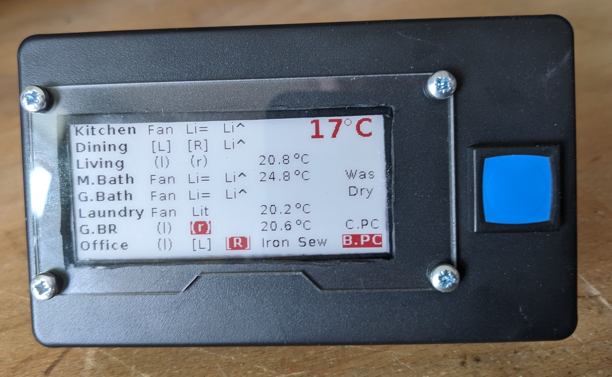
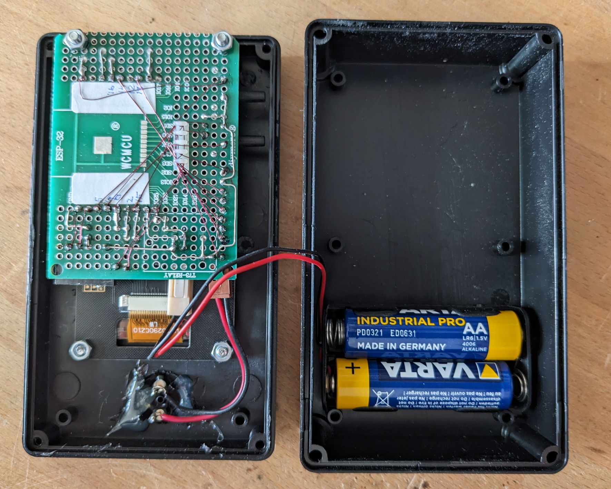
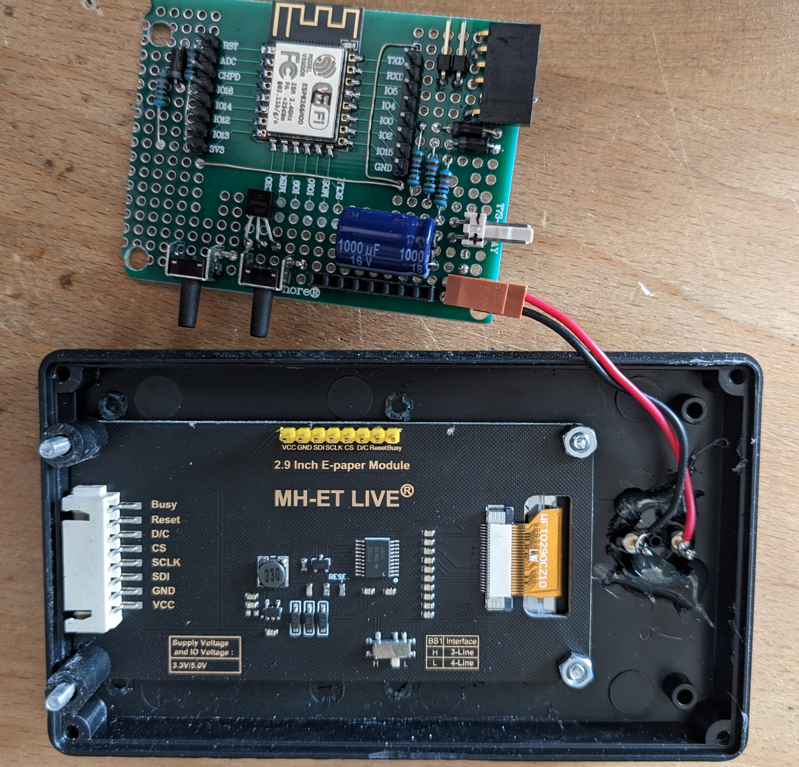

# MyDashboard for OpenHAB -- home status at a glance

This is part of my home automation setup. For details, see my [blog](https://requireiot.com/my-home-automation-story-part-1/).



## Objective

Before I leave the house, I want to see an overview of all relevant home automation variables
- are all the windows and doors closed?
- are all the lights off?
- is my computer off?
- is the washer or dryer still running?

For this, I have a small, battery-powered display next to the front door. It has a Wifi connection to the home network, and pulls all relevant OpenHAB variables via its REST interface, every hour, and at the push of a button.

The display layout and set of OpenHAB variables are configurable via a JSON text embedded in the source code -- in the future, this could also be read ffrom flash fiel storage, or pulled from an external server.

For details, see the [requirements specification](REQUIREMENTS.md).

## Architecture
- an ESP8266 module with custom software
- a 2.9" e-Ink display
- a pair of AA batteries, which should last for more than a year.

## Build instructions

 

The hardware is very simple, see the [schematic](hardware/MyDashboard-epaper.pdf).

The software was developed using [Platformio](https://platformio.org/). Just download the repository contents into an empty folder, and open that folder as a Platformio project.

In folder `src/`, rename file `myauth_sample.h` to `myauth.h` and enter your Wifi SSID and password.

## Configuration

Selection and display position of OpenHAB variables is done via a large JSON text embedded in the source code. Find the `layoutDefinition` variable and edit as needed for your configuration. At the top is a JSON array named `items`, which consists of multiple elements describing one display element each. Each display element has the following fields:
- mandatory `row` and `col` defining the location of the element on the screen (1,1 is top left), 
- optional `label` to define the text to be displayed
- optional `item` to define the OpenHAB item to access
- optional `attr` to define a comma-separated list of special attributes (see below)

My configuration looks like this
```
{ items: [
    { row:3, col: 1, label:"Living"   },
    { row:3, col: 8, label:"(l)",  item:"WZ_Window_L" },
    { row:3, col:11, label:"(r)",  item:"WZ_Window_R" },
    { row:3, col:20,               item:"WZ_Temp", attr:"right" },
]}
```
The following attributes are recognized:
- `right` : field is right-aligned , the row/col coordinate is the rightmost character
- `center` : field is centered on the row,col coordinate
- `green` : display field text in red (don't ask ...)
- `large` : field is displayed using a larger font

Layout elements are displayed as follows:
- elements where no OpenHAB `item` field is defined are displayed as is
- for OpenHAB items of type `Switch`, the field text is displayed in reverse, with a red background, if the item state is ON
- for OpenHAB items of type `Contact`, the field text is displayed in reverse, with a red background, if the item state is OPEN
- OpenHAB items of type `Number` are displayed using the format defined in the OpenHAB .items file 


## Dependencies

The dashboard software uses a slightly modified version of the Waveshare Arduino driver library for e-Paper displays, included in this repository, the origina Waveshare one is [here](https://github.com/soonuse/epd-library-arduino/tree/master/2.9inch_e-paper_b).

Text rendering is done with the excellent [TFT_eSPI library](https://github.com/Bodmer/TFT_eSPI), using fonts (in the fonts/ subfolder) generated with the help of the [Squix font converter](https://oleddisplay.squix.ch/).


## Over-the-air update

The device supports OTA firmware updates, despite the fact that it is in deep sleep most of the time. How? When it wakes up, it checks an OpenHAB switch item named `EnableOTA`, and if that is ON, then the device does not go back to sleep, but waits for an OTA request. It also turns the OpenHAB item back to OFF. 

So, for an OTA firmware updatem
- compile your code for the target that has "-ota" in its name (look at `platformio.ini` and adjust the IP address or device hostname to match your conguration)
- set the OpenHAB item `EnableOTA` to ON, e.g. using the REST API, or Basic UI, or shatever you prefer
- wait for the item to revert to OFF
- upload your firmware from Platformio

## Power saving considerations

- minimize deep sleep power consumption:
  - a bare ESP-12F module is better than a Wemos D1 or NodeMCU development module -- probably due to the voltage regulator and USB interfaces on those modules
  - while the e-Ink *display* consumes virtually no power when displaying static content, the e-Ink *module* consumes ~250µA, probably due to level shifters. Solution: the e-Ink module must be powered off during sleep. It is powered from a GPIO line of the ESP8266
  - connect the processor directly to batteries without a voltage regulator, avoiding any quiescent current. A bare ESP-12F on bench power supply works down to **2.2V**, fails at **2.0V**, so should be ok with 2x AA batteries
  - even with the e-Ink display module powered off, there is still some currect due to pull-up resistors on the ESP8266 side, if GPIO0 and GPIO2 are connected directly to the display module. Solution: connect to display module via Schottky diodes.
- minimize the duration of active Wifi during a wake period:
  - try to reconnect to Wifi using previously established SSID, IP and channel number, which are cached in flash file system
  - parsing the layout definition requires network access for REST requests to the OpenHAB server
  - the parsed layout definition is cached in flash fiel system
  - parsing the layout definition only occurs if it differs from the cached version ( as determined by comparing CRC checksums)
 
Power consumption, ESP8266 with 2.9" e-Ink, during deep sleep:
- with NodeMCU, USB powered: **360µA**
- with bare ESP-12F, 3.3V powered: **250µA**
- with bare ESP-12F, 3.3V powered, e-Ink power disconnected: **16µA**

## Power consumption and battery life
These factors contribute to power consumption or battery drain, in decreasing order of importance:
1. the self-discharge of the batteries, according to [[1]](http://www.gammon.com.au/power), about 80 µA or **1.92 mAh** per day
2. wake time with WiFi on, at 90 mA x ~2s per wakeup, or **1.2 mAh** per day
3. wake time with WiFi off, waiting for the display to refresh, at 5mA x 18s per wakeup, or **0.6 mAh** per day
4. deep sleep, at ~20 µA or **0.48 mAh** per day -- if we were using a development module with 250 µA current consumption in deep sleep, this would rise to **6 mAh** per day!

I noticed a mysterious, very short (100ms) peak in power consumption at 80mA, just before entering deep sleep. Can't exxxxxxxxxxxxxxxxxxplain it, didn't bother to explore further, because it is very short.